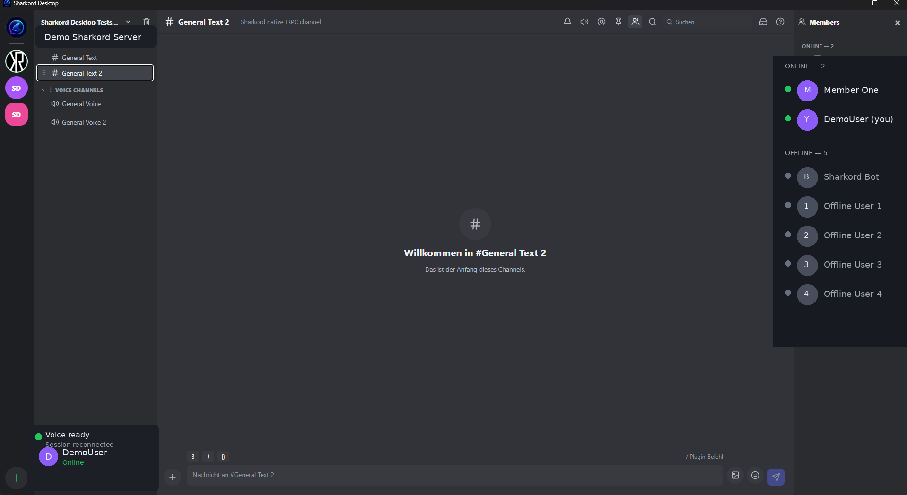
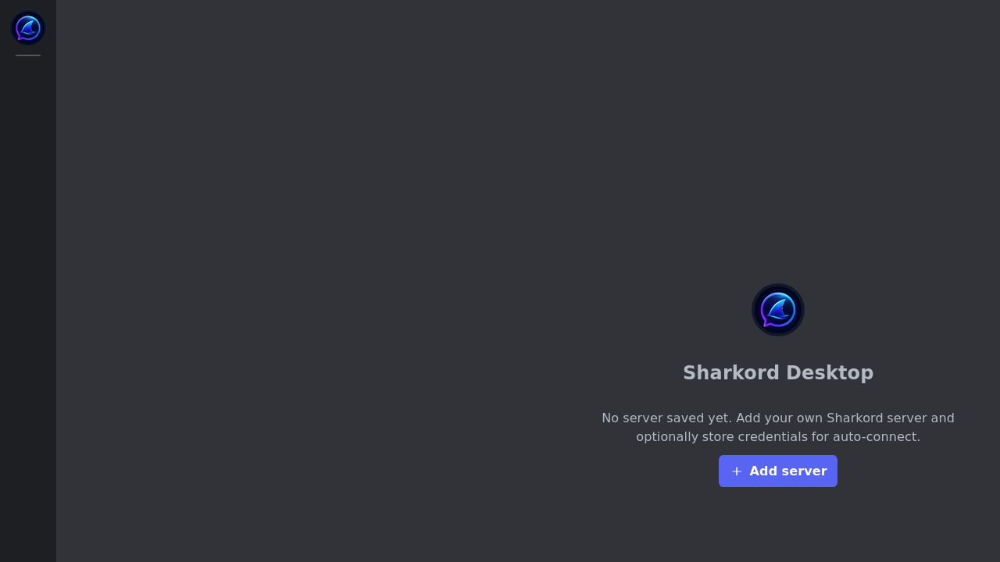
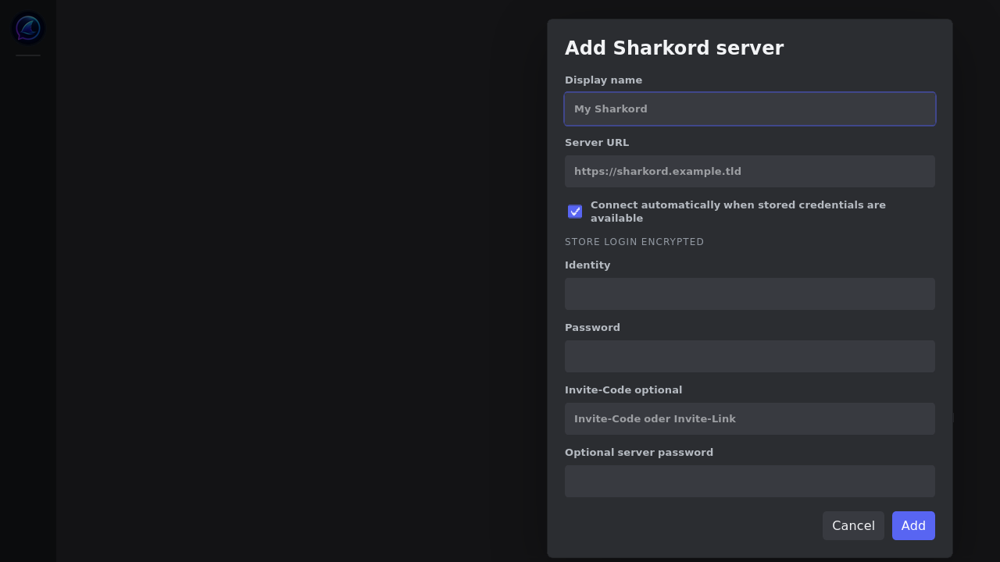
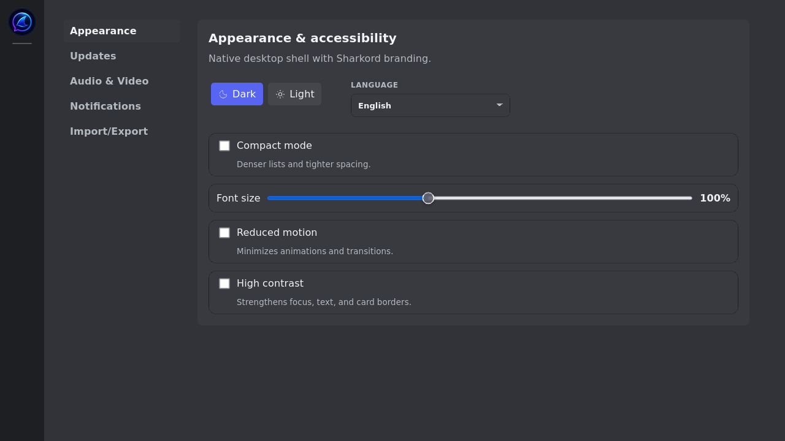
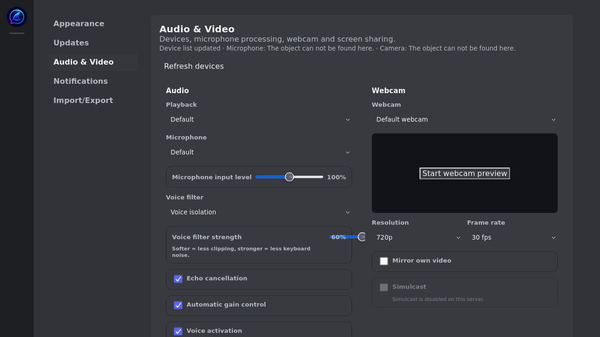
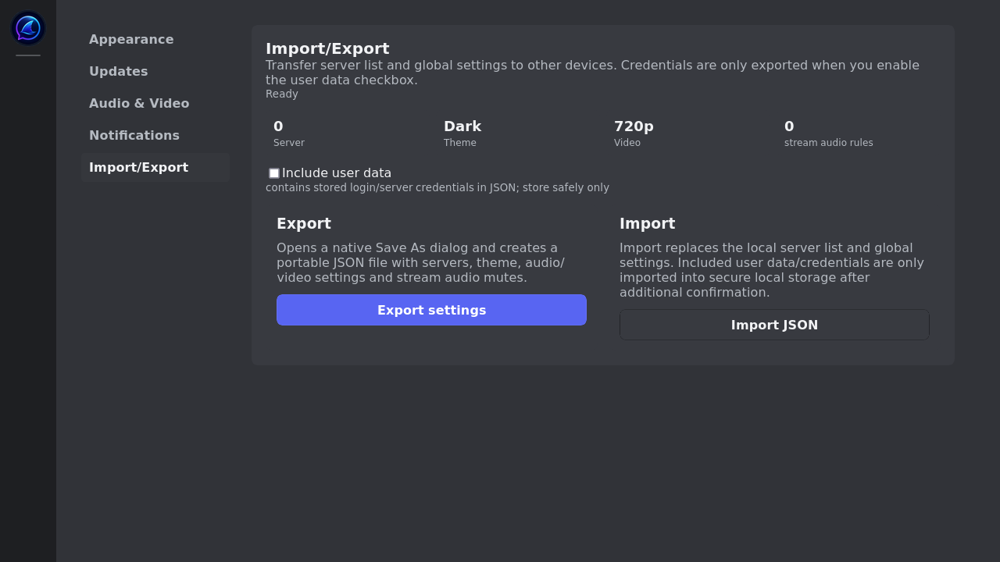

# Sharkord Desktop Releases

Public release repository for **Sharkord Desktop**, the native desktop client for self-hosted Sharkord servers.

**Latest stable:** `v0.5.13`

**Latest release:** <https://github.com/kanuracer/sharkord-desktop-releases/releases/tag/v0.5.13>

**Desktop source:** <https://github.com/kanuracer/sharkord-desktop>

**Kanuracer server fork:** <https://github.com/kanuracer/sharkord-server>

Sharkord Desktop is a real native desktop shell for Sharkord. It is built with Wails, Go, React, TypeScript, and Vite. It is not Electron, and it is not an iframe around the web client.

---

## Screenshots

### Full chat layout



The main desktop layout includes the server switcher, channel list, text channel view, composer, voice/status footer, and the full member sidebar.

### First-run onboarding



The first-run screen starts with a clean server list and guides the user to add a Sharkord server.

### Add a server



Add a server by URL, optional invite code, optional server password, and encrypted saved login credentials for auto-connect.

### Appearance and accessibility



Configure dark/light theme, language, compact mode, reduced motion, high contrast, and font size from the native settings screen.

### Audio, video, and screen sharing



Configure playback, microphone, webcam, voice filters, echo cancellation, screen-sharing resolution, frame rate, codec, bitrate, and system audio options.

### Import and export



Export and import desktop settings through native file dialogs. User data and saved credentials are optional and must be explicitly included.

---

## Downloads

| Platform | File | Download |
|---|---|---|
| Windows amd64 | `sharkord-desktop-0.5.13-windows-amd64.exe` | [Download](https://github.com/kanuracer/sharkord-desktop-releases/releases/download/v0.5.13/sharkord-desktop-0.5.13-windows-amd64.exe) |
| Linux amd64 | `sharkord-desktop-0.5.13-linux-amd64.tar.gz` | [Download](https://github.com/kanuracer/sharkord-desktop-releases/releases/download/v0.5.13/sharkord-desktop-0.5.13-linux-amd64.tar.gz) |
| macOS arm64 | `sharkord-desktop-0.5.13-darwin-arm64.zip` | [Download](https://github.com/kanuracer/sharkord-desktop-releases/releases/download/v0.5.13/sharkord-desktop-0.5.13-darwin-arm64.zip) |

Checksums are published in [`SHA256SUMS.txt`](SHA256SUMS.txt):

```text
1d5e3a021951c5e4b81083fef4a7ac7e8932a54f33afa6bff45ccca153eed362  sharkord-desktop-0.5.13-darwin-arm64.zip
2b53af8e7bb26956e89e4403710011843ddf4daf6fd50a3ac52618c5f81c67dc  sharkord-desktop-0.5.13-linux-amd64.tar.gz
8a85605419802a315821b3cddb16985683e7eda080a1aca33fc3c64a1ac8167a  sharkord-desktop-0.5.13-windows-amd64.exe
```

### Verify downloads

Linux/macOS:

```bash
sha256sum -c SHA256SUMS.txt
```

Windows PowerShell:

```powershell
Get-FileHash .\sharkord-desktop-0.5.13-windows-amd64.exe -Algorithm SHA256
```

The Windows hash should be:

```text
8a85605419802a315821b3cddb16985683e7eda080a1aca33fc3c64a1ac8167a
```

---

## Installation

### Windows

1. Download `sharkord-desktop-0.5.13-windows-amd64.exe`.
2. Run the installer/executable.
3. If Windows SmartScreen appears, review the file source and continue only if you trust this release.
4. Add your Sharkord server and sign in with your Sharkord identity.

### Linux

```bash
tar -xzf sharkord-desktop-0.5.13-linux-amd64.tar.gz
./sharkord-desktop
```

Some distributions may require WebKit/GTK runtime packages because Sharkord Desktop is built with Wails.

### macOS arm64

1. Download `sharkord-desktop-0.5.13-darwin-arm64.zip`.
2. Extract the ZIP.
3. Move the `.app` bundle to `/Applications`.
4. On first launch, use right-click → Open if Gatekeeper blocks a normal double-click launch.

---

## Feature overview

### Native desktop shell

- Wails/Go native desktop backend.
- React/TypeScript/Vite frontend.
- No Electron runtime.
- No iframe around the web client.
- Persistent window size and position.
- Native settings for updates, appearance, audio/video, notifications, and import/export.

### Multi-server and login

- Save multiple Sharkord servers.
- Add servers by URL or invite link.
- Optional server password support.
- Optional auto-connect with saved credentials.
- Local encrypted credential storage:
  - Windows: DPAPI-backed storage.
  - Linux/macOS: AES-GCM storage through the native app backend.

### Chat and channels

- Text channels and channel groups.
- Send, edit, and delete messages.
- Rich composer output.
- Replies and thread view.
- Reactions.
- Pinned messages.
- Typing status.
- Read/unread state.
- File uploads.
- Image and attachment lightbox.
- Storage file previews where supported by the server.

### Direct messages

- Direct-message overview.
- Open new DM conversations.
- DM unread counters.
- **Delete DM conversations** on compatible Kanuracer servers.
- On unsupported servers, the DM delete action stays visible and opens an in-app unsupported-feature dialog instead of calling a missing server mutation.

### Voice, video, and screen sharing

- Join and leave voice channels.
- Mute microphone.
- Mute/deafen playback.
- Enable webcam.
- Share screen.
- Optional system audio for screen sharing when supported by the platform/WebView.
- Microphone, playback, and webcam device selection.
- Echo cancellation, noise suppression, automatic gain control, and voice isolation.
- Video and screen-sharing resolution, FPS, bitrate, codec, and optimization controls.
- Stream popout viewer.
- **Move voice users between voice channels** on compatible Kanuracer servers when the user has the `MOVE_MEMBERS` permission.

### Search and navigation

- Command palette with `Ctrl/Cmd + K`.
- Fast navigation to servers, channels, DMs, and desktop actions.
- Global message and file search when the connected server supports search.

### Server administration

Depending on server permissions and advertised capabilities, Sharkord Desktop can expose admin tools for:

- Server settings.
- Server name, description, and logo.
- Roles and permissions.
- Channel and category management.
- Channel permission overrides.
- User administration and moderation.
- Invites.
- Emojis.
- Storage settings, quotas, and own stored files.
- Plugins, plugin marketplace, and plugin commands.
- **Owner-token actions** on compatible Kanuracer servers.
- **Server self-update** on compatible Kanuracer servers.

### Updates

- Stable and beta release channels.
- In-app update checks through GitHub Releases.
- Platform-specific asset matching for Windows, Linux, and macOS.
- Changelog display in Settings → Updates.
- Manual downloads through this release repository.

### Import and export

- Export app settings to JSON.
- Import settings through native file dialogs.
- Optional export of saved user data and credentials.
- Import validation for file type and schema version.

### Language and accessibility

- English and German UI.
- Dark and light theme.
- Compact mode.
- Reduced motion.
- High contrast.
- Adjustable font size.
- Regression coverage for mixed-language UI text.

---

## Kanuracer server fork features

Sharkord Desktop detects server capabilities after login. It does not guess server support from the domain, image tag, or version string. Compatible Kanuracer servers expose a desktop capability endpoint; original Sharkord servers fall back to the base feature set.

| Feature | Capability | Desktop behavior |
|---|---|---|
| Delete DM conversations | `directMessageDelete` | Enables DM conversation deletion on compatible servers. |
| Owner-token actions | `ownerToken` | Shows owner-token actions only when the server advertises support. |
| Server self-update | `serverSelfUpdate` | Shows server update controls only when the server supports them. |
| Move voice users | `voiceUserMove` | Enables voice user move controls when supported and permitted. |

This keeps Sharkord Desktop compatible with original Sharkord while unlocking fork-only controls on `kanuracer/sharkord-server`.

---

## Compatibility

| Target | Status |
|---|---|
| Original Sharkord server | Base desktop features; fork-only actions are disabled or shown as unsupported. |
| `kanuracer/sharkord-server` | Base features plus capability-gated fork features. |
| Windows amd64 | Release asset available. |
| Linux amd64 | Release asset available. |
| macOS arm64 | Release asset available. |
| macOS amd64 | No current `v0.5.13` asset. |

---

## Update metadata

The app uses GitHub Releases as the update source. This repository also keeps [`latest.json`](latest.json) for release metadata.

Latest release API:

```text
https://api.github.com/repos/kanuracer/sharkord-desktop-releases/releases/latest
```

Release download URL pattern:

```text
https://github.com/kanuracer/sharkord-desktop-releases/releases/download/v0.5.13/<asset-name>
```

---

## Release notes

`v0.5.13` summary:

- Preserves unsaved local role and permission edits while realtime role updates arrive.
- Includes the `v0.5.12` English locale fixes for corrupted fallback text such as `Privatee Voice Channels` and `3 Categoryn`.

Full notes: [`RELEASE_NOTES.md`](RELEASE_NOTES.md)

---

## FAQ

### Is this the server?

No. This repository contains public desktop release artifacts. The Kanuracer server fork is here:

- <https://github.com/kanuracer/sharkord-server>

### Is this the desktop source code?

No. The desktop source code is here:

- <https://github.com/kanuracer/sharkord-desktop>

### Why do I not see DM delete, server update, owner-token, or voice move controls?

Those features depend on the connected server. Sharkord Desktop enables them only when the server advertises the matching capability. Original Sharkord servers and older Kanuracer server builds may not expose those capabilities.

### Which version should I install?

Use the newest GitHub Release for your platform. Current stable: `v0.5.13`.

### Can I use beta releases?

The desktop app supports release channels. Stable is the default; beta builds may appear separately depending on the current release state.

---

## Project status

Sharkord is alpha software. Sharkord Desktop follows that status: server APIs and desktop capabilities can change, and older servers may not support newer desktop actions.

For the best experience, keep both Sharkord Desktop and `kanuracer/sharkord-server` up to date.
