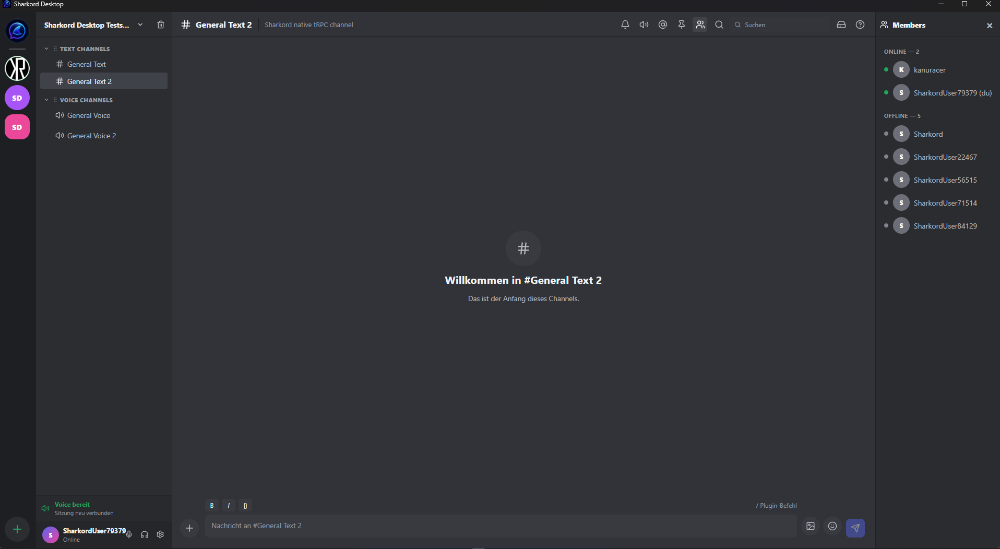
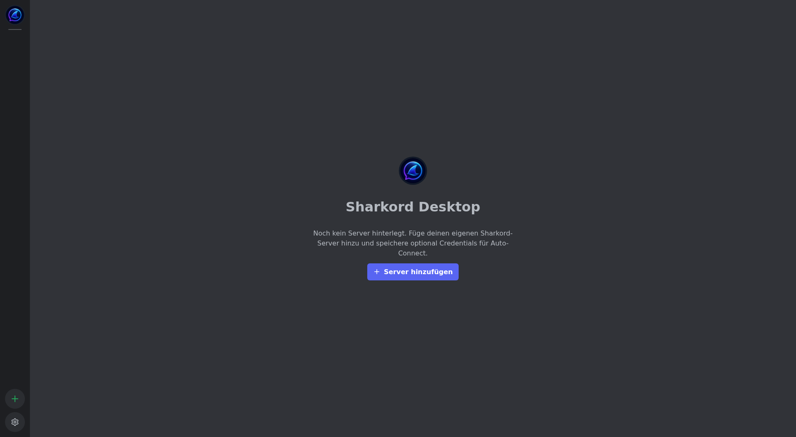
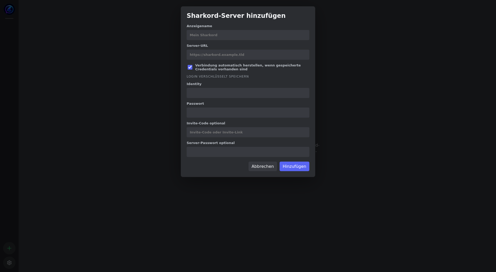
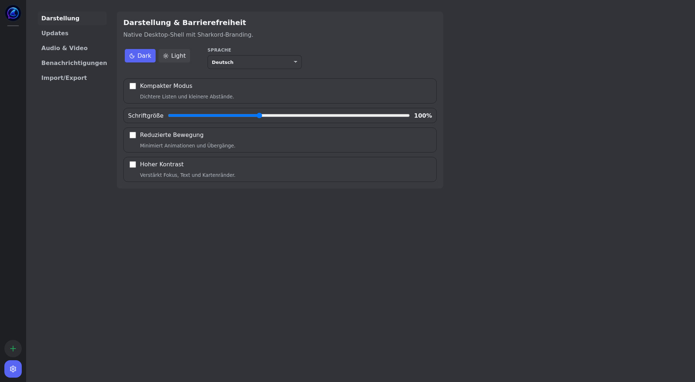
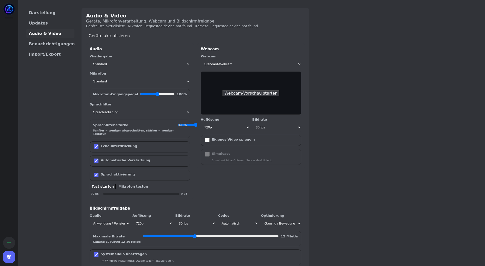
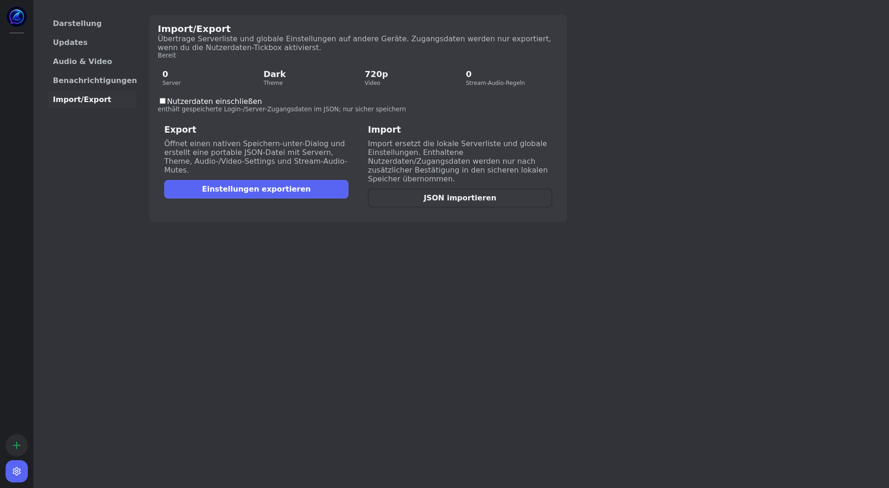
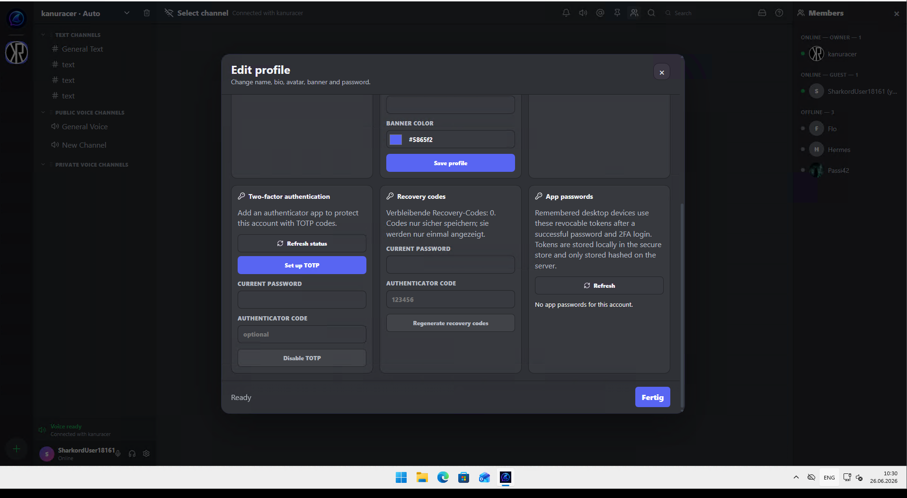
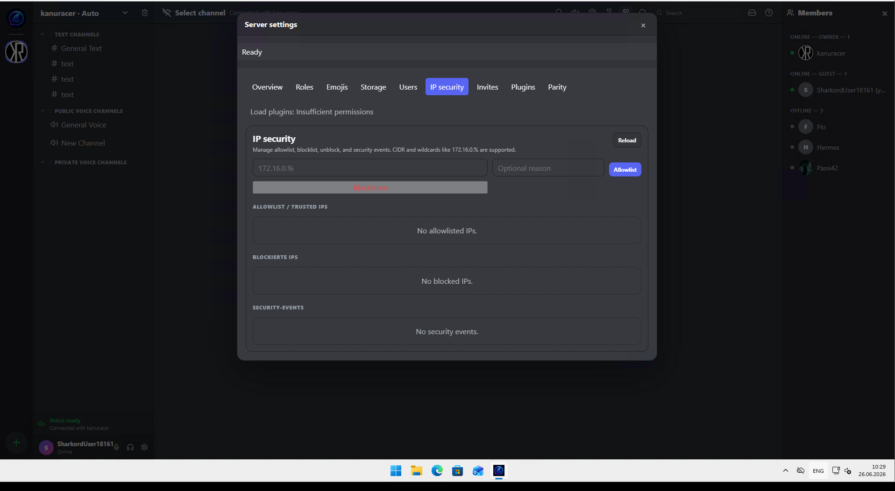
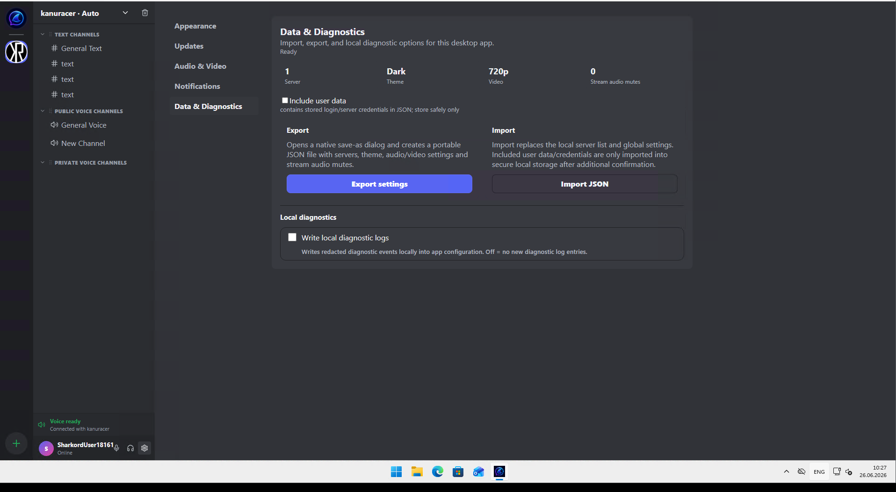

# Sharkord Desktop Releases

Public release repository for **Sharkord Desktop**, the native desktop client for self-hosted Sharkord servers.

**Latest stable:** `v0.5.47`

**Latest stable release:** <https://github.com/kanuracer/sharkord-desktop-releases/releases/tag/v0.5.47>

**Latest beta:** `v0.5.49`

**Latest beta release:** <https://github.com/kanuracer/sharkord-desktop-releases/releases/tag/v0.5.49>

**Kanuracer server fork:** <https://github.com/kanuracer/sharkord-server>

Sharkord Desktop is a real native desktop shell for Sharkord. It is built with Wails, Go, React, TypeScript, and Vite. It is not Electron, and it is not an iframe around the web client.

---

## Screenshots

### Full chat layout



The full desktop layout with server switcher, channel list, active text channel, composer, voice/status footer, top toolbar, and the right member sidebar.

### First-run welcome



The empty first-run state guides users to add their own Sharkord server.

### Add a server



Add a server URL, optional invite code, optional server password, and optional encrypted saved login credentials for auto-connect.

### Appearance and accessibility



Switch language/theme and configure compact mode, font size, reduced motion, and high contrast.

### Audio, video, and screen sharing



Configure playback, microphone, webcam, voice filters, screen-sharing resolution, frame rate, codec, bitrate, and system-audio options.

### Import and export



Export and import desktop settings through native file dialogs, with optional user data and credential export.

### Account security



Manage TOTP, recovery codes, remembered desktop devices, and app passwords from the real account security panel.

### IP security



Manage Kanuracer server IP allowlists, blocklists, unblock actions, and recent security events from Desktop server settings.

### Data and diagnostics



Import/export and local redacted diagnostics are grouped under Data & Diagnostics instead of Appearance.

---

## Downloads

| Platform | File | Download |
|---|---|---|
| Windows amd64 | `sharkord-desktop-0.5.47-windows-amd64.exe` | [Download](https://github.com/kanuracer/sharkord-desktop-releases/releases/download/v0.5.47/sharkord-desktop-0.5.47-windows-amd64.exe) |
| Linux amd64 | `sharkord-desktop-0.5.47-linux-amd64.tar.gz` | [Download](https://github.com/kanuracer/sharkord-desktop-releases/releases/download/v0.5.47/sharkord-desktop-0.5.47-linux-amd64.tar.gz) |
| macOS arm64 | `sharkord-desktop-0.5.47-darwin-arm64.zip` | [Download](https://github.com/kanuracer/sharkord-desktop-releases/releases/download/v0.5.47/sharkord-desktop-0.5.47-darwin-arm64.zip) |

Checksums are published in [`SHA256SUMS.txt`](SHA256SUMS.txt):

```text
5f4af105058614cc445557cd890dd739496a0ed50655f7b0d214de56514e0ff5  sharkord-desktop-0.5.47-darwin-arm64.zip
63d84770de503cb577321f00581606a19168b2da82ae8ab99a4fa97b188ffb93  sharkord-desktop-0.5.47-linux-amd64.tar.gz
6553196d527a67c94d0ac2eabbd236d075fc5bc6877abc199e631529263a9156  sharkord-desktop-0.5.47-windows-amd64.exe
```


### Latest beta downloads

Beta builds are published on the `beta` branch and as GitHub prereleases. Stable remains the default channel.

| Platform | File | Download |
|---|---|---|
| Windows amd64 | `sharkord-desktop-0.5.49-windows-amd64.exe` | [Download](https://github.com/kanuracer/sharkord-desktop-releases/releases/download/v0.5.49/sharkord-desktop-0.5.49-windows-amd64.exe) |
| Linux amd64 | `sharkord-desktop-0.5.49-linux-amd64.tar.gz` | [Download](https://github.com/kanuracer/sharkord-desktop-releases/releases/download/v0.5.49/sharkord-desktop-0.5.49-linux-amd64.tar.gz) |
| Source archive | `sharkord-desktop-v0.5.49-source.tar.gz` | [Download](https://github.com/kanuracer/sharkord-desktop-releases/releases/download/v0.5.49/sharkord-desktop-v0.5.49-source.tar.gz) |

Beta checksums:

```text
434dd34162652094faa643296cde2d0960740bad8193e384c1180949c60aaeb0  sharkord-desktop-0.5.49-windows-amd64.exe
225a81d00b7cebf747976781dadeb5eb7813f1f6b6ad8c15f39f159b200ddd5d  sharkord-desktop-0.5.49-linux-amd64.tar.gz
4aded50c36b26e96c491809edc6695d66b5612fcae5a1e21016448a73e8b975c  sharkord-desktop-v0.5.49-source.tar.gz
```

### Verify downloads

Linux/macOS:

```bash
sha256sum -c SHA256SUMS.txt
```

Windows PowerShell:

```powershell
Get-FileHash .\sharkord-desktop-0.5.47-windows-amd64.exe -Algorithm SHA256
```

The Windows hash should be:

```text
6553196d527a67c94d0ac2eabbd236d075fc5bc6877abc199e631529263a9156
```

---

## Installation

### Windows

1. Download `sharkord-desktop-0.5.47-windows-amd64.exe`.
2. Run the installer/executable.
3. If Windows SmartScreen appears, review the file source and continue only if you trust this release.
4. Add your Sharkord server and sign in with your Sharkord identity.

### Linux

```bash
tar -xzf sharkord-desktop-0.5.47-linux-amd64.tar.gz
./sharkord-desktop
```

Some distributions may require WebKit/GTK runtime packages because Sharkord Desktop is built with Wails.

### macOS arm64

1. Download `sharkord-desktop-0.5.47-darwin-arm64.zip`.
2. Extract the ZIP.
3. Move the `.app` bundle to `/Applications`.
4. On first launch, use right-click → Open if Gatekeeper blocks a normal double-click launch.

---

## Feature overview

### Native desktop shell

- Wails/Go native desktop backend.
- React/TypeScript/Vite frontend.
- No Electron runtime.
- No iframe around the web client.
- Persistent window size and position.
- Native settings for updates, appearance, audio/video, notifications, and import/export.

### Multi-server and login

- Save multiple Sharkord servers.
- Add servers by URL or invite link.
- Optional server password support.
- Optional auto-connect with saved credentials.
- Two-factor login dialog when the server requires TOTP/MFA.
- App-password based remembered devices on compatible Kanuracer servers.
- Local encrypted credential storage:
  - Windows: DPAPI-backed storage.
  - Linux/macOS: AES-GCM storage through the native app backend.

### Chat and channels

- Text channels and channel groups.
- Send, edit, and delete messages.
- Rich composer output.
- Replies and thread view.
- Message reactions, including custom-emoji reaction rendering where the connected server supports it.
- Pinned messages.
- Typing status.
- Read/unread state.
- File uploads.
- Image and attachment lightbox.
- Storage file previews where supported by the server.

### Direct messages

- Direct-message overview.
- Open new DM conversations.
- DM unread counters.
- **Delete DM conversations** on compatible Kanuracer servers.
- On unsupported servers, the DM delete action stays visible and opens an in-app unsupported-feature dialog instead of calling a missing server mutation.


### Account security

On compatible Kanuracer servers, users can manage account-security features directly from the Desktop account profile:

- TOTP setup with a scannable QR code.
- TOTP enable/disable flows.
- Recovery-code display and regeneration.
- Remembered desktop devices backed by revocable app passwords.
- App-password list and revoke actions.
- Two-factor login prompt that does not store one-time codes.

### Voice, video, and screen sharing

- Join and leave voice channels.
- Mute microphone.
- Mute/deafen playback.
- Enable webcam.
- Share screen.
- Optional system audio for screen sharing when supported by the platform/WebView.
- Microphone, playback, and webcam device selection.
- Echo cancellation, noise suppression, automatic gain control, and voice isolation.
- Video and screen-sharing resolution, FPS, bitrate, codec, and optimization controls.
- Stream popout viewer.
- **Move voice users between voice channels** on compatible Kanuracer servers when the user has the `MOVE_MEMBERS` permission.

### Search and navigation

- Command palette with `Ctrl/Cmd + K`.
- Fast navigation to servers, channels, DMs, and desktop actions.
- Global message and file search when the connected server supports search.

### Server administration

Depending on server permissions and advertised capabilities, Sharkord Desktop can expose admin tools for:

- Server settings.
- Server name, description, and logo.
- Roles and permissions.
- Channel and category management.
- Channel permission overrides.
- User administration and moderation.
- IP allowlist/blocklist management, unblock actions, and recent security-event review.
- Invites.
- Emojis.
- Storage settings, quotas, and own stored files.
- Plugins, plugin marketplace, and plugin commands.
- **Owner-token actions** on compatible Kanuracer servers.
- **Server self-update** on compatible Kanuracer servers.

### Updates

- Stable and beta release channels.
- In-app update checks through GitHub Releases.
- Platform-specific asset matching for Windows, Linux, and macOS.
- Changelog display in Settings → Updates.
- Manual downloads through this release repository.

### Import and export

- Export app settings to JSON.
- Import settings through native file dialogs.
- Optional export of saved user data and credentials.
- Import validation for file type and schema version.

### Language and accessibility

- English and German UI.
- Dark and light theme.
- Compact mode.
- Reduced motion.
- High contrast.
- Adjustable font size.
- Regression coverage for mixed-language UI text.

---

## Kanuracer server fork features

Sharkord Desktop detects server capabilities after login. It does not guess server support from the domain, image tag, or version string. Compatible Kanuracer servers expose a desktop capability endpoint; original Sharkord servers fall back to the base feature set.

| Feature | Capability | Desktop behavior |
|---|---|---|
| Delete DM conversations | `directMessageDelete` | Enables DM conversation deletion on compatible servers. |
| Owner-token actions | `ownerToken` | Shows owner-token actions only when the server advertises support. |
| Server self-update | `serverSelfUpdate` | Shows server update controls only when the server supports them. |
| Move voice users | `voiceUserMove` | Enables voice user move controls when supported and permitted. |
| IP security | `securityIpRules` | Enables allowlist, blocklist, unblock, and recent security-event tools. |
| Account security | `mfaAppPasswords` / account-security routes | Enables TOTP, recovery-code, remembered-device, and app-password management. |

This keeps Sharkord Desktop compatible with original Sharkord while unlocking fork-only controls on `kanuracer/sharkord-server`.

---

## Compatibility

| Target | Status |
|---|---|
| Original Sharkord server | Base desktop features; fork-only actions are disabled or shown as unsupported. |
| `kanuracer/sharkord-server` | Base features plus capability-gated fork features. |
| Windows amd64 | Release asset available. |
| Linux amd64 | Release asset available. |
| macOS arm64 | Release asset available. |
| macOS amd64 | No current asset. |

---

## Update metadata

The app uses GitHub Releases as the update source. This repository also keeps branch-specific `latest.json` files for release metadata.

- Stable feed: [`main/latest.json`](https://raw.githubusercontent.com/kanuracer/sharkord-desktop-releases/main/latest.json)
- Beta feed: [`beta/latest.json`](https://raw.githubusercontent.com/kanuracer/sharkord-desktop-releases/beta/latest.json)

Latest release API:

```text
https://api.github.com/repos/kanuracer/sharkord-desktop-releases/releases/latest
```

Release download URL pattern:

```text
https://github.com/kanuracer/sharkord-desktop-releases/releases/download/v<version>/<asset-name>
```

---

## Release notes

`v0.5.47` stable summary:

- Fixes Desktop IP-security compatibility with the current Kanuracer server.
- Keeps security-event and IP-rule actions aligned with current server routes and payloads.

`v0.5.48` beta summary:

- Removes the old remote live-debug sender from the Desktop app.
- Keeps voice diagnostics local, redacted, and opt-in.

`v0.5.49` beta summary:

- Moves local diagnostic logging into Data & Diagnostics.
- Keeps Appearance focused on theme, language, and accessibility options.
- Current beta provides Windows, Linux, and source archive assets.

Full notes: [`RELEASE_NOTES.md`](RELEASE_NOTES.md)

---

## FAQ

### Is this the server?

No. This repository contains public desktop release artifacts. The Kanuracer server fork is here:

- <https://github.com/kanuracer/sharkord-server>

### Why do I not see DM delete, server update, owner-token, or voice move controls?

Those features depend on the connected server. Sharkord Desktop enables them only when the server advertises the matching capability. Original Sharkord servers and older Kanuracer server builds may not expose those capabilities.

### Which version should I install?

Use the newest stable GitHub Release for normal installs. Current stable: `v0.5.47`. Current beta: `v0.5.49`. Use beta only if you intentionally selected the beta channel.

### Can I use beta releases?

The desktop app supports release channels. Stable is the default; beta builds may appear separately depending on the current release state.

---

## Project status

Sharkord is alpha software. Sharkord Desktop follows that status: server APIs and desktop capabilities can change, and older servers may not support newer desktop actions.

For the best experience, keep both Sharkord Desktop and `kanuracer/sharkord-server` up to date.
